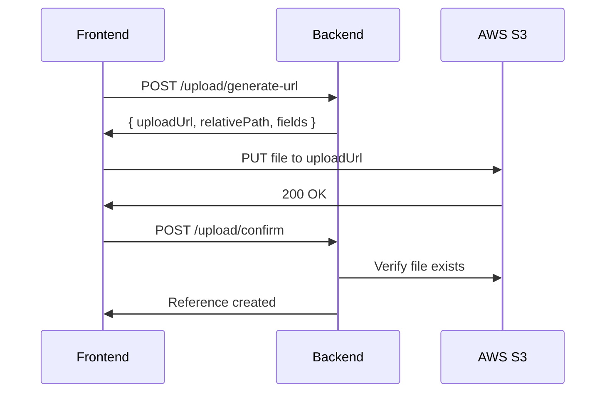
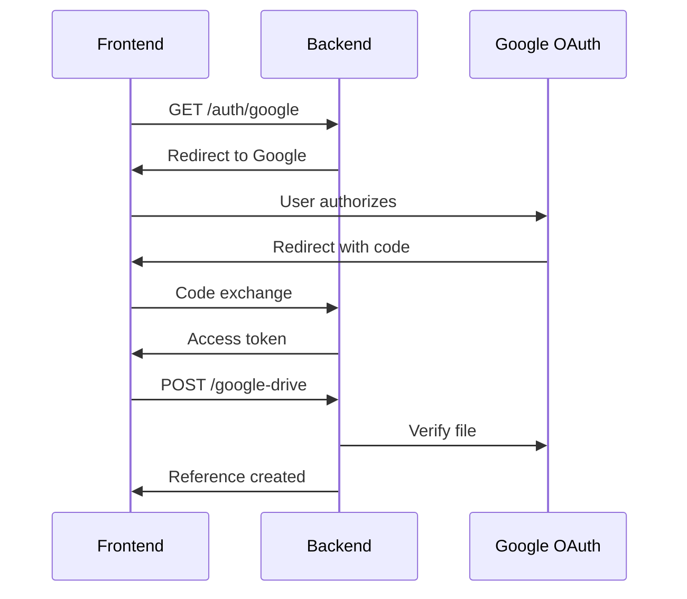

# Homework Reference Materials - Complete Implementation Guide

## Table of Contents
1. [Overview](#overview)
2. [Architecture](#architecture)
3. [Complete Homework Response](#complete-homework-response)
4. [API Endpoints](#api-endpoints)
5. [Data Models](#data-models)
6. [Upload Workflows](#upload-workflows)
7. [Frontend Integration Guide](#frontend-integration-guide)
8. [Database Migration](#database-migration)
9. [Error Handling](#error-handling)
10. [Security Considerations](#security-considerations)

---

## Overview

The Homework Reference Materials system allows teachers to attach multiple reference materials to homework assignments. Each homework can have unlimited references supporting various types:

### Supported Reference Types
| Type | Description | File Extensions | Max Size |
|------|-------------|-----------------|----------|
| `VIDEO` | Video files | mp4, webm, ogg, mov, avi, wmv | 500 MB |
| `IMAGE` | Image files | jpg, png, gif, webp, svg, bmp | 10 MB |
| `PDF` | PDF documents | pdf | 50 MB |
| `DOCUMENT` | Office documents | doc, docx, xls, xlsx, ppt, pptx, txt, rtf | 50 MB |
| `AUDIO` | Audio files | mp3, wav, ogg, webm, aac, m4a | 100 MB |
| `LINK` | External URLs | N/A | N/A |
| `OTHER` | Any other file | Any | 100 MB |

### Supported Upload Sources
| Source | Description | Use Case |
|--------|-------------|----------|
| `S3_UPLOAD` | Upload to AWS S3 | Large files, videos, documents |
| `GOOGLE_DRIVE` | Link from Google Drive | Files already in Drive |
| `MANUAL_LINK` | External URL | YouTube, websites, external resources |

---

## Complete Homework Response

The homework API now supports fetching complete homework data with references and submissions in one call.

### Request
```http
GET /institute-class-subject-homeworks?classId=40&subjectId=5&includeReferences=true&includeSubmissions=true
Authorization: Bearer <token>
```

### Response Structure
```json
{
  "data": [
    {
      "id": "123",
      "title": "Mathematics Assignment - Chapter 5",
      "description": "Solve exercises 1-10 from textbook",
      "instituteId": "44",
      "classId": "40",
      "subjectId": "5",
      "teacherId": "100",
      "startDate": "2026-01-20T00:00:00.000Z",
      "endDate": "2026-01-27T23:59:59.000Z",
      "referenceLink": null,
      "teacher": {
        "id": "100",
        "nameWithInitials": "A.B. Teacher",
        "imageUrl": "https://bucket.s3.amazonaws.com/users/teacher.jpg",
        "email": "teacher@example.com"
      },
      "references": [
        {
          "id": "1",
          "title": "Chapter 5 Video Lecture",
          "description": "Full video explanation",
          "referenceType": "VIDEO",
          "referenceSource": "S3_UPLOAD",
          "displayOrder": 0,
          "viewUrl": "https://bucket.s3.amazonaws.com/homework-references/123/lecture.mp4",
          "fileName": "lecture.mp4",
          "fileSize": 52428800,
          "mimeType": "video/mp4",
          "videoDuration": 3600,
          "thumbnailUrl": null
        },
        {
          "id": "2",
          "title": "Practice Problems PDF",
          "referenceType": "PDF",
          "referenceSource": "S3_UPLOAD",
          "displayOrder": 1,
          "viewUrl": "https://bucket.s3.amazonaws.com/homework-references/123/problems.pdf",
          "fileName": "problems.pdf",
          "fileSize": 1048576,
          "mimeType": "application/pdf"
        },
        {
          "id": "3",
          "title": "YouTube Tutorial",
          "referenceType": "LINK",
          "referenceSource": "MANUAL_LINK",
          "displayOrder": 2,
          "viewUrl": "https://www.youtube.com/watch?v=example"
        }
      ],
      "referenceCount": 3,
      "mySubmissions": [
        {
          "id": "456",
          "studentId": "200",
          "studentName": "John Student",
          "studentImageUrl": "https://bucket.s3.amazonaws.com/users/student.jpg",
          "submissionDate": "2026-01-22T14:30:00.000Z",
          "fileUrl": "https://bucket.s3.amazonaws.com/submissions/456/homework.pdf",
          "teacherCorrectionFileUrl": null,
          "driveFileId": null,
          "driveViewUrl": null,
          "submissionType": "UPLOAD",
          "remarks": null,
          "isActive": true,
          "createdAt": "2026-01-22T14:30:00.000Z"
        }
      ],
      "hasSubmitted": true,
      "submissionCount": 25
    }
  ],
  "total": 10,
  "page": 1,
  "limit": 10,
  "totalPages": 1,
  "hasNext": false,
  "hasPrev": false
}
```

### Response Fields by User Type

| Field | Student | Teacher/Admin |
|-------|---------|---------------|
| `references` | ✅ All references | ✅ All references |
| `referenceCount` | ✅ | ✅ |
| `mySubmissions` | ✅ Own submissions only | ✅ All submissions |
| `hasSubmitted` | ✅ Boolean | ❌ |
| `submissionCount` | ❌ | ✅ Total count |

---

## CRUD Operations by User Type

This section defines all create, read, update, and delete operations for homework, references, and submissions based on user roles.

### User Types
| User Type | Code | Description |
|-----------|------|-------------|
| Student | `USER`, `USER_WITHOUT_PARENT` | Students enrolled in classes |
| Teacher | `TEACHER` | Teachers assigned to subjects |
| Institute Admin | `INSTITUTE_ADMIN` | Full institute management access |
| Super Admin | `SUPER_ADMIN` | System-wide access |

---

### Homework CRUD Operations

| Operation | Student | Teacher | Institute Admin | Super Admin |
|-----------|---------|---------|-----------------|-------------|
| **GET** List Homeworks | ✅ Own classes | ✅ Own subjects | ✅ All | ✅ All |
| **GET** Single Homework | ✅ Own classes | ✅ Own subjects | ✅ All | ✅ All |
| **POST** Create Homework | ❌ | ✅ Own subjects | ✅ All | ✅ All |
| **PATCH** Update Homework | ❌ | ✅ Own homeworks | ✅ All | ✅ All |
| **DELETE** Delete Homework | ❌ | ✅ Own homeworks | ✅ All | ✅ All |

#### Create Homework (Teacher/Admin)
```http
POST /institute-class-subject-homeworks
Authorization: Bearer <teacher-token>
Content-Type: application/json

{
  "title": "Mathematics Assignment - Chapter 5",
  "description": "Solve exercises 1-10",
  "classId": "40",
  "subjectId": "5",
  "startDate": "2026-01-20T00:00:00.000Z",
  "endDate": "2026-01-27T23:59:59.000Z"
}
```

#### Update Homework (Teacher who created / Admin)
```http
PATCH /institute-class-subject-homeworks/123
Authorization: Bearer <teacher-token>
Content-Type: application/json

{
  "title": "Updated Title",
  "description": "Updated description",
  "endDate": "2026-01-30T23:59:59.000Z"
}
```

#### Delete Homework (Soft Delete)
```http
DELETE /institute-class-subject-homeworks/123
Authorization: Bearer <teacher-token>
```

---

### Reference CRUD Operations

| Operation | Student | Teacher | Institute Admin | Super Admin |
|-----------|---------|---------|-----------------|-------------|
| **GET** List References | ✅ Own class homeworks | ✅ Own subject homeworks | ✅ All | ✅ All |
| **GET** Single Reference | ✅ Own class homeworks | ✅ Own subject homeworks | ✅ All | ✅ All |
| **POST** Create Reference | ❌ | ✅ Own homeworks | ✅ All | ✅ All |
| **PATCH** Update Reference | ❌ | ✅ Own homeworks | ✅ All | ✅ All |
| **DELETE** Soft Delete | ❌ | ✅ Own homeworks | ✅ All | ✅ All |
| **DELETE** Permanent Delete | ❌ | ❌ | ✅ All | ✅ All |
| **PATCH** Restore | ❌ | ✅ Own homeworks | ✅ All | ✅ All |

#### Create Reference - S3 Upload (Teacher/Admin)

**Step 1: Generate Upload URL**
```http
POST /homework-references/upload/generate-url
Authorization: Bearer <teacher-token>
Content-Type: application/json

{
  "homeworkId": "123",
  "fileName": "lecture.mp4",
  "contentType": "video/mp4",
  "fileSize": 52428800,
  "referenceType": "VIDEO"
}
```

**Step 2: Upload to S3** (Frontend direct upload using signed URL)

**Step 3: Confirm Upload**
```http
POST /homework-references/upload/confirm
Authorization: Bearer <teacher-token>
Content-Type: application/json

{
  "homeworkId": "123",
  "title": "Chapter 5 Lecture",
  "referenceType": "VIDEO",
  "relativePath": "homework-references/123/lecture-uuid.mp4",
  "fileName": "lecture.mp4",
  "fileSize": 52428800,
  "mimeType": "video/mp4"
}
```

#### Create Reference - Google Drive (Teacher/Admin)
```http
POST /homework-references/google-drive
Authorization: Bearer <teacher-token>
Content-Type: application/json

{
  "homeworkId": "123",
  "title": "Assignment Template",
  "referenceType": "DOCUMENT",
  "driveFileId": "1BxiMVs0XRA5nFMdKvBdBZjgmUUqptlbs74OgvE2upms",
  "accessToken": "ya29.a0AfH6SMBx..."
}
```

#### Create Reference - External Link (Teacher/Admin)
```http
POST /homework-references/link
Authorization: Bearer <teacher-token>
Content-Type: application/json

{
  "homeworkId": "123",
  "title": "YouTube Tutorial",
  "referenceType": "LINK",
  "externalUrl": "https://www.youtube.com/watch?v=example"
}
```

#### Update Reference (Teacher who owns homework / Admin)
```http
PATCH /homework-references/456
Authorization: Bearer <teacher-token>
Content-Type: application/json

{
  "title": "Updated Reference Title",
  "description": "Updated description",
  "displayOrder": 2
}
```

#### Delete Reference - Soft Delete (Teacher/Admin)
```http
DELETE /homework-references/456
Authorization: Bearer <teacher-token>
```

#### Delete Reference - Permanent (Institute Admin Only)
```http
DELETE /homework-references/456/permanent
Authorization: Bearer <admin-token>
```
> ⚠️ **Warning:** Permanently deletes the database record AND S3 file. Cannot be undone.

#### Restore Deleted Reference (Teacher/Admin)
```http
PATCH /homework-references/456/restore
Authorization: Bearer <teacher-token>
```

---

### Submission CRUD Operations

| Operation | Student | Teacher | Institute Admin | Super Admin |
|-----------|---------|---------|-----------------|-------------|
| **GET** List Submissions | ✅ Own only | ✅ All in subject | ✅ All | ✅ All |
| **GET** Single Submission | ✅ Own only | ✅ All in subject | ✅ All | ✅ All |
| **POST** Create Submission | ✅ Own only | ❌ | ❌ | ❌ |
| **PATCH** Update Submission | ✅ Own (before deadline) | ✅ Add remarks/corrections | ✅ All | ✅ All |
| **DELETE** Delete Submission | ✅ Own (before deadline) | ✅ All in subject | ✅ All | ✅ All |

#### Create Submission (Student Only)

**Option 1: File Upload**
```http
POST /institute-class-subject-homeworks-submission
Authorization: Bearer <student-token>
Content-Type: multipart/form-data

homeworkId: 123
file: <binary file data>
remarks: "My completed homework"
```

**Option 2: Google Drive**
```http
POST /institute-class-subject-homeworks-submission/google-drive
Authorization: Bearer <student-token>
Content-Type: application/json

{
  "homeworkId": "123",
  "driveFileId": "1BxiMVs0XRA5nFMdKvBdBZjgmUUqptlbs74OgvE2upms",
  "accessToken": "ya29.a0AfH6SMBx...",
  "remarks": "My completed homework"
}
```

#### Update Submission - Student (Before Deadline)
```http
PATCH /institute-class-subject-homeworks-submission/456
Authorization: Bearer <student-token>
Content-Type: multipart/form-data

file: <new file>
remarks: "Updated submission"
```

#### Update Submission - Teacher (Add Remarks/Corrections)
```http
PATCH /institute-class-subject-homeworks-submission/456/review
Authorization: Bearer <teacher-token>
Content-Type: multipart/form-data

remarks: "Good work! See corrections attached."
correctionFile: <binary file data>
grade: "A"
```

#### Delete Submission - Student (Own, Before Deadline)
```http
DELETE /institute-class-subject-homeworks-submission/456
Authorization: Bearer <student-token>
```

#### Delete Submission - Teacher/Admin (Any in their subject)
```http
DELETE /institute-class-subject-homeworks-submission/456
Authorization: Bearer <teacher-token>
```

---

### Permission Matrix Summary

```
┌─────────────────────────────────────────────────────────────────────────────┐
│                        HOMEWORK SYSTEM PERMISSIONS                          │
├─────────────────────────────────────────────────────────────────────────────┤
│                                                                             │
│  STUDENTS (USER, USER_WITHOUT_PARENT)                                       │
│  ├── View: Own class homeworks, references, own submissions                 │
│  ├── Create: Submissions only                                               │
│  ├── Update: Own submissions (before deadline)                              │
│  └── Delete: Own submissions (before deadline)                              │
│                                                                             │
│  TEACHERS                                                                   │
│  ├── View: All in assigned subjects                                         │
│  ├── Create: Homeworks, References                                          │
│  ├── Update: Own homeworks, references, add remarks to submissions          │
│  └── Delete: Own homeworks, references (soft delete)                        │
│                                                                             │
│  INSTITUTE ADMIN                                                            │
│  ├── View: Everything in institute                                          │
│  ├── Create: Homeworks, References                                          │
│  ├── Update: Everything                                                     │
│  └── Delete: Everything (including permanent delete)                        │
│                                                                             │
│  SUPER ADMIN                                                                │
│  └── Full system access                                                     │
│                                                                             │
└─────────────────────────────────────────────────────────────────────────────┘
```

### Frontend Implementation Notes

#### Role Detection
```typescript
// Check user type from JWT token
const userType = user.ut; // 'USER', 'USER_WITHOUT_PARENT', 'TEACHER', 'INSTITUTE_ADMIN', 'SUPER_ADMIN'

const isStudent = userType === 'USER' || userType === 'USER_WITHOUT_PARENT';
const isTeacher = userType === 'TEACHER';
const isAdmin = userType === 'INSTITUTE_ADMIN' || userType === 'SUPER_ADMIN';
```

#### Show/Hide UI Elements
```typescript
// Homework Actions
const canCreateHomework = isTeacher || isAdmin;
const canEditHomework = (isTeacher && homework.teacherId === user.userId) || isAdmin;
const canDeleteHomework = canEditHomework;

// Reference Actions  
const canAddReference = canEditHomework;
const canDeleteReference = canEditHomework;
const canPermanentDelete = isAdmin;

// Submission Actions
const canSubmit = isStudent && !homework.hasSubmitted && new Date() <= homework.endDate;
const canEditSubmission = isStudent && new Date() <= homework.endDate;
const canDeleteSubmission = isStudent ? (new Date() <= homework.endDate) : (isTeacher || isAdmin);
const canReviewSubmission = isTeacher || isAdmin;
```

#### Conditional UI Example
```tsx
// React/JSX Example
{canCreateHomework && (
  <Button onClick={openCreateHomeworkModal}>+ New Homework</Button>
)}

{canAddReference && (
  <Button onClick={openAddReferenceModal}>+ Add Reference</Button>
)}

{isStudent && !hasSubmitted && (
  <Button onClick={openSubmitModal}>Submit Homework</Button>
)}

{isTeacher && (
  <Button onClick={openReviewModal}>Review Submissions ({submissionCount})</Button>
)}
```

---

## Architecture

```
┌─────────────────────────────────────────────────────────────────┐
│                     Frontend Application                         │
└─────────────────────────────────────────────────────────────────┘
                              │
                              ▼
┌─────────────────────────────────────────────────────────────────┐
│                   HomeworkReferenceController                    │
│  /homework-references/*                                         │
└─────────────────────────────────────────────────────────────────┘
                              │
                              ▼
┌─────────────────────────────────────────────────────────────────┐
│                   HomeworkReferenceService                       │
│  - CRUD operations                                              │
│  - S3 signed URL generation                                     │
│  - Google Drive integration                                     │
│  - Access validation                                            │
└─────────────────────────────────────────────────────────────────┘
                              │
              ┌───────────────┼───────────────┐
              ▼               ▼               ▼
        ┌──────────┐   ┌──────────┐   ┌────────────┐
        │   AWS    │   │  Google  │   │  Database  │
        │   S3     │   │  Drive   │   │  (MySQL)   │
        └──────────┘   └──────────┘   └────────────┘
```

### Entity Relationship
```
InstituteClassSubjectHomework (1) ──────────► (N) InstituteClassSubjectHomeworkReference
         │                                              │
         └── references: Reference[]                    └── homework: Homework
```

---

## API Endpoints

### Base URL: `/homework-references`

### 1. Create Reference (Generic)
```http
POST /homework-references
Authorization: Bearer <token>
Content-Type: application/json

{
  "homeworkId": "123",
  "title": "Chapter 1 Study Material",
  "description": "Complete study guide for chapter 1",
  "referenceType": "PDF",
  "referenceSource": "S3_UPLOAD",
  "displayOrder": 0,
  "fileUrl": "homework-references/123/study-guide.pdf",
  "fileName": "study-guide.pdf",
  "fileSize": 1048576,
  "mimeType": "application/pdf"
}
```

### 2. Generate S3 Upload URL
```http
POST /homework-references/upload/generate-url
Authorization: Bearer <token>
Content-Type: application/json

{
  "homeworkId": "123",
  "fileName": "lecture-video.mp4",
  "contentType": "video/mp4",
  "fileSize": 52428800,
  "referenceType": "VIDEO"
}
```

**Response:**
```json
{
  "uploadUrl": "https://bucket.s3.region.amazonaws.com/...",
  "relativePath": "homework-references/123/lecture-video-uuid.mp4",
  "fields": {
    "key": "homework-references/123/lecture-video-uuid.mp4",
    "Content-Type": "video/mp4",
    "...": "..."
  },
  "expiresIn": 3600,
  "maxFileSize": 524288000
}
```

### 3. Confirm S3 Upload
```http
POST /homework-references/upload/confirm
Authorization: Bearer <token>
Content-Type: application/json

{
  "homeworkId": "123",
  "title": "Lecture Video - Chapter 1",
  "description": "Full lecture recording",
  "referenceType": "VIDEO",
  "relativePath": "homework-references/123/lecture-video-uuid.mp4",
  "fileName": "lecture-video.mp4",
  "fileSize": 52428800,
  "mimeType": "video/mp4",
  "videoDuration": 3600
}
```

### 4. Create from Google Drive
```http
POST /homework-references/google-drive
Authorization: Bearer <token>
Content-Type: application/json

{
  "homeworkId": "123",
  "title": "Assignment Template",
  "description": "Use this template for your assignment",
  "referenceType": "DOCUMENT",
  "driveFileId": "1BxiMVs0XRA5nFMdKvBdBZjgmUUqptlbs74OgvE2upms",
  "accessToken": "ya29.a0AfH6SMBx..."
}
```

### 5. Create from External Link
```http
POST /homework-references/link
Authorization: Bearer <token>
Content-Type: application/json

{
  "homeworkId": "123",
  "title": "YouTube Tutorial",
  "description": "Watch this video for better understanding",
  "referenceType": "VIDEO",
  "externalUrl": "https://www.youtube.com/watch?v=dQw4w9WgXcQ",
  "linkTitle": "Watch on YouTube",
  "videoDuration": 212
}
```

### 6. Get All References (with filtering)
```http
GET /homework-references?homeworkId=123&referenceType=VIDEO&page=1&limit=10
Authorization: Bearer <token>
```

**Query Parameters:**
| Parameter | Type | Description |
|-----------|------|-------------|
| `homeworkId` | string | Filter by homework |
| `referenceType` | enum | Filter by type (VIDEO, IMAGE, PDF, etc.) |
| `referenceSource` | enum | Filter by source (S3_UPLOAD, GOOGLE_DRIVE, MANUAL_LINK) |
| `isActive` | boolean | Filter by active status (default: true) |
| `search` | string | Search in title/description |
| `page` | number | Page number (default: 1) |
| `limit` | number | Items per page (default: 10, max: 100) |
| `sortBy` | string | Sort field (displayOrder, title, createdAt, referenceType) |
| `sortOrder` | ASC/DESC | Sort direction |

### 7. Get References by Homework
```http
GET /homework-references/homework/123
Authorization: Bearer <token>
```

### 8. Get Reference Summary
```http
GET /homework-references/homework/123/summary
Authorization: Bearer <token>
```

**Response:**
```json
{
  "total": 5,
  "byType": {
    "VIDEO": 2,
    "PDF": 2,
    "LINK": 1
  },
  "bySource": {
    "S3_UPLOAD": 3,
    "GOOGLE_DRIVE": 1,
    "MANUAL_LINK": 1
  }
}
```

### 9. Get Single Reference
```http
GET /homework-references/456
Authorization: Bearer <token>
```

### 10. Update Reference
```http
PATCH /homework-references/456
Authorization: Bearer <token>
Content-Type: application/json

{
  "title": "Updated Title",
  "description": "Updated description",
  "displayOrder": 1
}
```

### 11. Reorder References
```http
PATCH /homework-references/homework/123/reorder
Authorization: Bearer <token>
Content-Type: application/json

{
  "referenceIds": ["3", "1", "2"]
}
```

### 12. Soft Delete Reference
```http
DELETE /homework-references/456
Authorization: Bearer <token>
```

### 13. Permanent Delete Reference
```http
DELETE /homework-references/456/permanent
Authorization: Bearer <token>
```
> ⚠️ **Warning:** This permanently deletes the reference AND the S3 file. Cannot be undone. Institute Admin only.

### 14. Bulk Soft Delete
```http
DELETE /homework-references/bulk
Authorization: Bearer <token>
Content-Type: application/json

{
  "ids": ["1", "2", "3"]
}
```

### 15. Restore Deleted Reference
```http
PATCH /homework-references/456/restore
Authorization: Bearer <token>
```

---

## Data Models

### Reference Entity
```typescript
interface HomeworkReference {
  id: string;
  homeworkId: string;
  uploadedById?: string;
  
  // Metadata
  title: string;
  description?: string;
  referenceType: 'VIDEO' | 'IMAGE' | 'PDF' | 'DOCUMENT' | 'LINK' | 'AUDIO' | 'OTHER';
  referenceSource: 'S3_UPLOAD' | 'GOOGLE_DRIVE' | 'MANUAL_LINK';
  displayOrder: number;
  
  // S3 Fields
  fileUrl?: string;
  fileName?: string;
  fileSize?: number;
  mimeType?: string;
  
  // Google Drive Fields
  driveFileId?: string;
  driveFileName?: string;
  driveMimeType?: string;
  driveFileSize?: number;
  
  // Manual Link Fields
  externalUrl?: string;
  linkTitle?: string;
  
  // Video Fields
  videoDuration?: number;  // in seconds
  thumbnailUrl?: string;
  
  // Status
  isActive: boolean;
  createdAt: Date;
  updatedAt: Date;
  
  // Computed URLs (in response)
  viewUrl?: string;
  driveViewUrl?: string;
  driveDownloadUrl?: string;
  driveEmbedUrl?: string;
}
```

### Response DTO
```typescript
interface HomeworkReferenceResponse {
  id: string;
  homeworkId: string;
  title: string;
  description?: string;
  referenceType: string;
  referenceSource: string;
  displayOrder: number;
  
  // URLs (computed, full URLs)
  viewUrl?: string;           // Primary viewable URL
  driveViewUrl?: string;      // Google Drive view URL
  driveDownloadUrl?: string;  // Google Drive download URL
  driveEmbedUrl?: string;     // Google Drive embed URL (for videos)
  
  // File info
  fileName?: string;
  fileSize?: number;
  mimeType?: string;
  
  // Video specific
  videoDuration?: number;
  thumbnailUrl?: string;
  
  // Status
  isActive: boolean;
  createdAt: Date;
  updatedAt: Date;
  
  // Uploader info
  uploadedBy?: {
    id: string;
    nameWithInitials?: string;
    email?: string;
  };
}
```

---

## Upload Workflows

### S3 Upload Workflow



**Frontend Implementation:**
```typescript
// Step 1: Generate upload URL
const generateResponse = await fetch('/homework-references/upload/generate-url', {
  method: 'POST',
  headers: {
    'Authorization': `Bearer ${token}`,
    'Content-Type': 'application/json',
  },
  body: JSON.stringify({
    homeworkId: '123',
    fileName: file.name,
    contentType: file.type,
    fileSize: file.size,
    referenceType: 'VIDEO',
  }),
});
const { uploadUrl, relativePath, fields } = await generateResponse.json();

// Step 2: Upload file to S3
const formData = new FormData();
Object.entries(fields).forEach(([key, value]) => {
  formData.append(key, value as string);
});
formData.append('file', file);

await fetch(uploadUrl, {
  method: 'POST',
  body: formData,
});

// Step 3: Confirm upload
const confirmResponse = await fetch('/homework-references/upload/confirm', {
  method: 'POST',
  headers: {
    'Authorization': `Bearer ${token}`,
    'Content-Type': 'application/json',
  },
  body: JSON.stringify({
    homeworkId: '123',
    title: 'My Video',
    referenceType: 'VIDEO',
    relativePath,
    fileName: file.name,
    fileSize: file.size,
    mimeType: file.type,
  }),
});
```

### Google Drive Workflow



**Frontend Implementation:**
```typescript
// Step 1: Open Google OAuth popup
const popup = window.open(
  'https://lmsapi.suraksha.lk/auth/google',
  'google-oauth',
  'width=500,height=600'
);

// Step 2: Listen for token from popup
window.addEventListener('message', async (event) => {
  if (event.data.type === 'google-oauth-success') {
    const { accessToken } = event.data;
    
    // Step 3: Create reference with Drive file
    const response = await fetch('/homework-references/google-drive', {
      method: 'POST',
      headers: {
        'Authorization': `Bearer ${token}`,
        'Content-Type': 'application/json',
      },
      body: JSON.stringify({
        homeworkId: '123',
        title: 'My Drive Document',
        referenceType: 'DOCUMENT',
        driveFileId: '1BxiMVs0XRA5nFMdKvBdBZjgmUUqptlbs74OgvE2upms',
        accessToken,
      }),
    });
  }
});
```

### Manual Link Workflow

**Frontend Implementation:**
```typescript
const response = await fetch('/homework-references/link', {
  method: 'POST',
  headers: {
    'Authorization': `Bearer ${token}`,
    'Content-Type': 'application/json',
  },
  body: JSON.stringify({
    homeworkId: '123',
    title: 'YouTube Tutorial',
    description: 'Watch this for better understanding',
    referenceType: 'VIDEO',
    externalUrl: 'https://www.youtube.com/watch?v=dQw4w9WgXcQ',
    linkTitle: 'Watch on YouTube',
  }),
});
```

---

## Frontend Integration Guide

### Getting Homework with References

```typescript
// Get homework with references included
const response = await fetch(
  '/institute-class-subject-homeworks?includeReferences=true&classId=40&subjectId=5',
  { headers: { 'Authorization': `Bearer ${token}` } }
);

const { data } = await response.json();

// Each homework now includes references
data.forEach(homework => {
  console.log(`Homework: ${homework.title}`);
  console.log(`References: ${homework.referenceCount}`);
  
  homework.references?.forEach(ref => {
    console.log(`- ${ref.title} (${ref.referenceType})`);
    console.log(`  View URL: ${ref.viewUrl}`);
  });
});
```

### Single Homework with References

```typescript
// Get single homework (references included by default)
const response = await fetch(
  '/institute-class-subject-homeworks/123',
  { headers: { 'Authorization': `Bearer ${token}` } }
);

const homework = await response.json();

// Render references by type
const videos = homework.references?.filter(r => r.referenceType === 'VIDEO');
const pdfs = homework.references?.filter(r => r.referenceType === 'PDF');
const links = homework.references?.filter(r => r.referenceType === 'LINK');
```

### React Component Example

```tsx
interface Reference {
  id: string;
  title: string;
  referenceType: string;
  referenceSource: string;
  viewUrl?: string;
  driveEmbedUrl?: string;
  fileName?: string;
  fileSize?: number;
  videoDuration?: number;
  thumbnailUrl?: string;
}

function ReferenceList({ references }: { references: Reference[] }) {
  const renderReference = (ref: Reference) => {
    switch (ref.referenceType) {
      case 'VIDEO':
        if (ref.referenceSource === 'GOOGLE_DRIVE' && ref.driveEmbedUrl) {
          return (
            <iframe
              src={ref.driveEmbedUrl}
              width="640"
              height="360"
              allow="autoplay"
            />
          );
        }
        return <video src={ref.viewUrl} controls />;
        
      case 'IMAGE':
        return ;
        
      case 'PDF':
        return (
          <a href={ref.viewUrl} target="_blank" rel="noopener">
            📄 {ref.fileName} ({formatFileSize(ref.fileSize)})
          </a>
        );
        
      case 'LINK':
        return (
          <a href={ref.viewUrl} target="_blank" rel="noopener">
            🔗 {ref.title}
          </a>
        );
        
      default:
        return (
          <a href={ref.viewUrl} target="_blank" rel="noopener">
            📁 {ref.fileName}
          </a>
        );
    }
  };

  return (
    <div className="reference-list">
      {references.map(ref => (
        <div key={ref.id} className="reference-item">
          <h4>{ref.title}</h4>
          {renderReference(ref)}
        </div>
      ))}
    </div>
  );
}

function formatFileSize(bytes?: number): string {
  if (!bytes) return '';
  const units = ['B', 'KB', 'MB', 'GB'];
  let i = 0;
  while (bytes >= 1024 && i < units.length - 1) {
    bytes /= 1024;
    i++;
  }
  return `${bytes.toFixed(1)} ${units[i]}`;
}
```

---

## Database Migration

### Run Migration

```bash
# Build first
npm run build

# Run migration
npm run typeorm migration:run
```

### Manual SQL (if needed)

```sql
CREATE TABLE `institute_class_subject_homework_references` (
  `id` bigint NOT NULL AUTO_INCREMENT,
  `homework_id` bigint NOT NULL,
  `uploaded_by_id` bigint DEFAULT NULL,
  `title` varchar(255) NOT NULL,
  `description` text,
  `reference_type` enum('VIDEO','IMAGE','PDF','DOCUMENT','LINK','AUDIO','OTHER') DEFAULT 'OTHER',
  `reference_source` enum('S3_UPLOAD','GOOGLE_DRIVE','MANUAL_LINK') DEFAULT 'S3_UPLOAD',
  `display_order` int DEFAULT 0,
  `file_url` varchar(500) DEFAULT NULL,
  `file_name` varchar(255) DEFAULT NULL,
  `file_size` bigint DEFAULT NULL,
  `mime_type` varchar(100) DEFAULT NULL,
  `drive_file_id` varchar(255) DEFAULT NULL,
  `drive_file_name` varchar(500) DEFAULT NULL,
  `drive_mime_type` varchar(100) DEFAULT NULL,
  `drive_file_size` bigint DEFAULT NULL,
  `external_url` varchar(1000) DEFAULT NULL,
  `link_title` varchar(255) DEFAULT NULL,
  `video_duration` int DEFAULT NULL COMMENT 'Duration in seconds',
  `thumbnail_url` varchar(500) DEFAULT NULL,
  `is_active` tinyint(1) DEFAULT 1,
  `created_at` timestamp DEFAULT CURRENT_TIMESTAMP,
  `updated_at` timestamp DEFAULT CURRENT_TIMESTAMP ON UPDATE CURRENT_TIMESTAMP,
  PRIMARY KEY (`id`),
  KEY `IDX_homework_reference_homework_id` (`homework_id`),
  KEY `IDX_homework_reference_type` (`reference_type`),
  KEY `IDX_homework_reference_source` (`reference_source`),
  KEY `IDX_homework_reference_is_active` (`is_active`),
  KEY `IDX_homework_reference_display_order` (`homework_id`, `display_order`),
  CONSTRAINT `FK_homework_reference_homework` FOREIGN KEY (`homework_id`) 
    REFERENCES `institute_class_subject_homeworks` (`id`) ON DELETE CASCADE,
  CONSTRAINT `FK_homework_reference_uploaded_by` FOREIGN KEY (`uploaded_by_id`) 
    REFERENCES `users` (`id`) ON DELETE SET NULL
);
```

---

## Error Handling

### Common Error Responses

| Status | Error | Description |
|--------|-------|-------------|
| 400 | `Invalid file type` | File MIME type not allowed for reference type |
| 400 | `File size exceeds limit` | File too large for reference type |
| 400 | `Could not access the Google Drive file` | Drive file doesn't exist or no permission |
| 400 | `File not found` | S3 upload confirmation failed |
| 401 | `Unauthorized` | Invalid or missing JWT token |
| 403 | `Forbidden` | User doesn't have access to homework |
| 404 | `Homework not found` | Invalid homework ID |
| 404 | `Reference not found` | Invalid reference ID |

### Error Response Format
```json
{
  "statusCode": 400,
  "message": "Invalid file type for VIDEO. Allowed types: video/mp4, video/webm, video/ogg, video/quicktime, video/x-msvideo, video/x-ms-wmv",
  "error": "Bad Request"
}
```

---

## Security Considerations

### Access Control
- **Teachers**: Can create, update, delete references for their own homework
- **Institute Admins**: Full access to all homework references in their institute
- **Students/Parents**: Read-only access to active references

### File Validation
- MIME type validation before upload URL generation
- File size limits enforced both client and server-side
- S3 signed URLs expire after 1 hour

### Google Drive
- Access tokens are validated before creating references
- File existence is verified via Google Drive API
- No tokens are stored server-side

### Soft Delete
- Default delete is soft (sets `isActive = false`)
- Hard delete only available to Institute Admins
- Hard delete removes S3 files permanently

---

## Summary

This implementation provides a complete homework reference materials system with:

✅ Multiple reference types (video, image, PDF, documents, links, audio)  
✅ Three upload sources (S3, Google Drive, manual links)  
✅ Full CRUD operations with proper access control  
✅ Soft delete with restore capability  
✅ Bulk operations (delete multiple)  
✅ Reordering functionality  
✅ Integration with existing homework APIs  
✅ Comprehensive documentation and examples  

For questions or issues, contact the development team.
